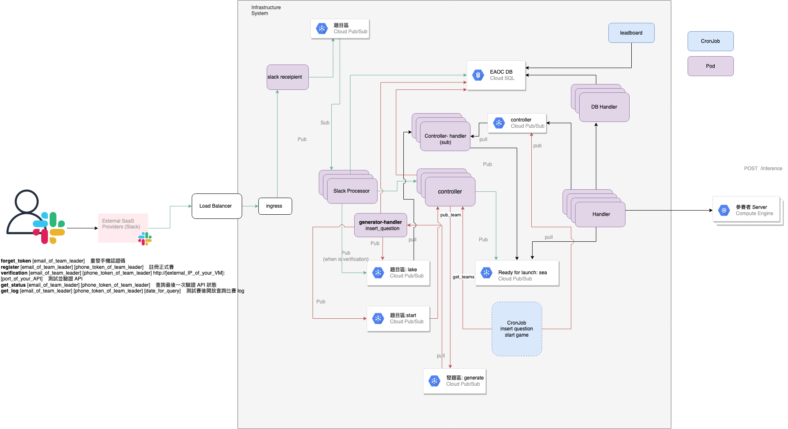

<p align="center">
  <a href="./README.md"> English </a> | <a href="./README.zh-TW.md"> 繁體中文

  <p align="center">
  <target="_blank">
    
  </a>
</p>
  
<p align="center">
  玉山商業銀行股份有限公司開發<br></a>
<br>

</p>


[](https://www.gnu.org/licenses/lgpl-3.0)
[](https://www.python.org/downloads/release/python-370/)

# AI_arena

AI_arena 是個 API 評分系統，讓想舉辦 Machine Learning API 比賽的人，利用此系統建立參賽者身份認證、API server認證、發出API request 的整套機制。

## Requirements
本系統需使用 Google Cloud Platform 相關元件完成建置。包含 GKE、cloud logging、GCS、pub/sub等。
前端使用 slack 當作使用者介面。

## Prerequisites
- GCP 使用相關元件的 service account json file
- 準備一個 slack workspace，新增一個 slack app
- 建立所需的 pub/sub topic
  - generator-{env}
  - controller-{env}
  - lake-{env}
  - sea-{env}
  - slack-msg-{env}

## 系統架構

## Getting Started
0. init 一座 GKE cluster 、cloudSQL
1. 到 ai_arena 底下的各元件 build dockerfile，並 push 至對應 Container Registry

```
cd ai_arena/<各元件名稱>
docker build -t <Container Registry>/<image name>/
```
2. 將 json file 及相關參數放置 chart/Values.yml
3. 到 chart/ 下
```
helm install ai-arena .
```
